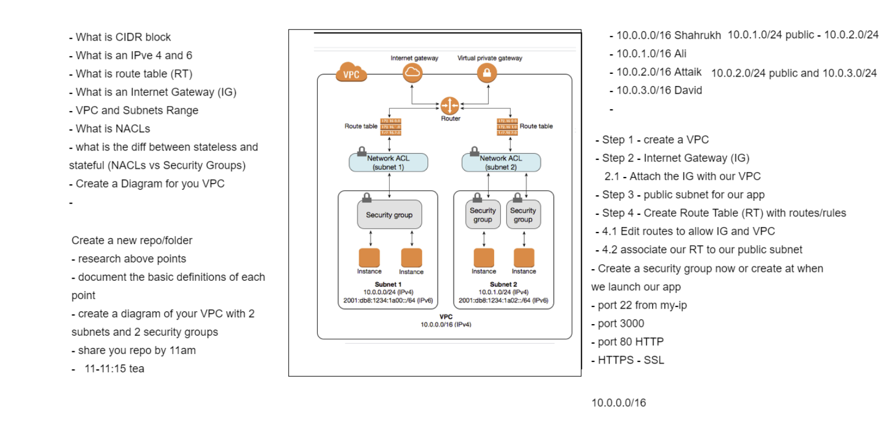
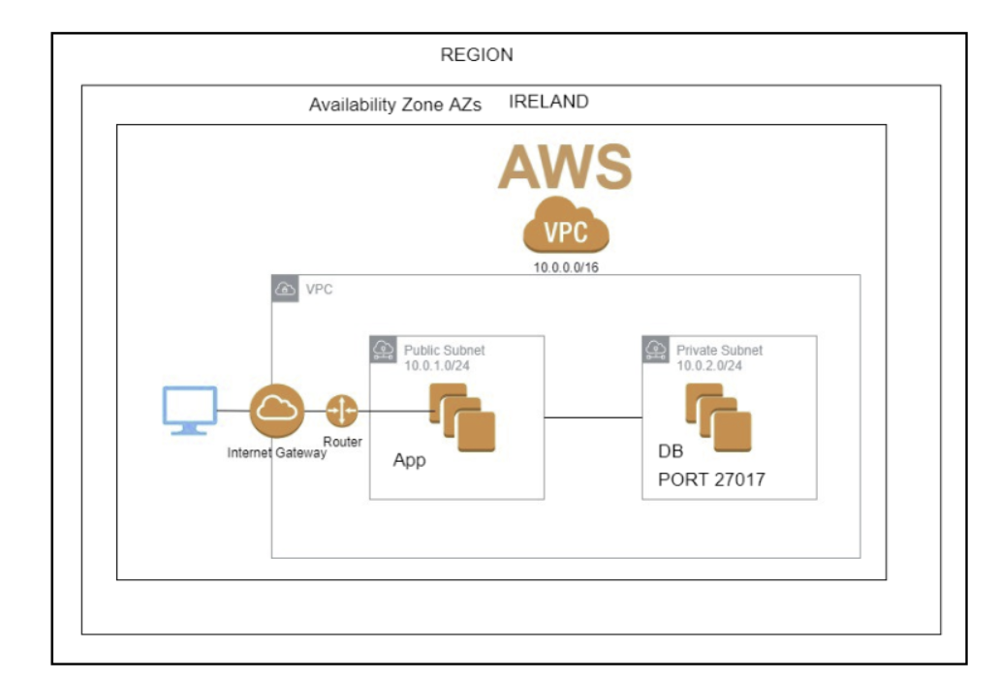

# AWS Networking 
## VPC
### 2Tier Architecture Deployment

**AWS Networking**
- IP address
- Cdir block
- IPV4 and ipv6

**VPC and its resources**
- 
- Route table rules
- SG rules
- Subnets cidr blocks
- connectivity between app and db and app nat db

**2 Tier Achitecture Deployment in our own VPC**
- 
- should have all rules at all levels required

